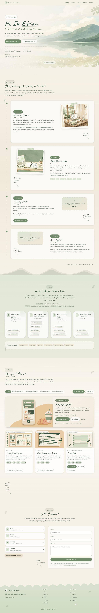

# Jenny-lyn's Portfolio 🌿

A storybook + nature-journal personal portfolio — hand-painted landscapes, chapter-by-chapter
journey, and a project library you can grow **without touching any code**.

Built with **React + Vite** (plain JavaScript, no CSS framework — a small hand-written design
system instead).



<sub>Full-page desktop capture · `docs/preview-desktop.jpg` · project details sheet in `docs/preview-project-details.jpg` · mobile in `docs/preview-mobile.jpg`</sub>

---

## Quick start

```bash
npm install
npm run dev        # http://localhost:5173
npm run build      # production bundle in dist/
npm run preview    # serve the built bundle on http://localhost:4173
```

Everything renders from local assets: fonts are self-hosted in `public/fonts`, artwork lives in
`public/` and `public/projects`. No CDN, no tracking, no runtime dependency beyond React.

---

## Project structure

```
portfolio/
├─ index.html                  # meta tags, Google-font preconnect, #root
├─ public/
│  ├─ fonts/                    # self-hosted Caveat + Nunito (latin subset)
│  ├─ hero-landscape.jpg        # painted hero scenery
│  ├─ illustrations/            # chapter artwork
│  ├─ projects/                 # starter project thumbnails
│  └─ favicon.svg
├─ src/
│  ├─ App.jsx                   # page composition (Navbar → Hero → Journey → Skills → Projects → Contact → Footer)
│  ├─ main.jsx                  # entry; loads base.css + forms.css
│  ├─ data/
│  │  ├─ site.js                # name, nav, journey chapters, skills  ← content lives here
│  │  └─ projects.js            # starter project library + category list
│  ├─ components/
│  │  ├─ Navbar.jsx  Hero.jsx  Journey.jsx  Skills.jsx
│  │  ├─ Projects.jsx  ProjectCard.jsx  ProjectFilter.jsx
│  │  ├─ FeaturedSpotlight.jsx  ProjectModal.jsx  ProjectDetails.jsx
│  │  ├─ Contact.jsx  Footer.jsx  BackToTop.jsx
│  │  ├─ Toast.jsx  ConfirmDialog.jsx  Decor.jsx  Icons.jsx
│  │  └─ *.css                  # one stylesheet per component
│  ├─ hooks/
│  │  ├─ useScrollReveal.js     # IntersectionObserver reveal helper
│  │  ├─ useScrollSpy.js        # active nav link
│  │  ├─ useParallax.js         # rAF-throttled hero drift
│  │  ├─ useLocalStorage.js     # persistent state
│  │  └─ useProjects.js         # project library CRUD + persistence
│  ├─ utils/
│  │  ├─ metadata.js            # link → title/description/image/favicon lookup
│  │  ├─ image.js               # image compression + SVG placeholders
│  │  └─ links.js               # forgiving URL helpers
│  └─ styles/
│     ├─ base.css               # design tokens, reset, typography, animations
│     ├─ forms.css              # shared form controls
│     └─ site.css               # page scaffolding, print styles
└─ README.md
```

---

## Adding a project

### 1. Through the website (no code)

Click **Add Project** in the Projects section:

| Field               | Notes                                                                        |
| ------------------- | ---------------------------------------------------------------------------- |
| Project URL         | Pasting a link triggers a metadata lookup (see below)                        |
| GitHub URL          | Repos also pull a name, description, language and social preview             |
| Title / Description | Required — everything else is optional                                       |
| Image               | Paste a URL **or** upload a screenshot (auto-compressed, max 1280px)         |
| Category            | Web Development · Desktop Applications · School Projects · Personal Projects |
| Technologies        | Type and press Enter/comma, or tap a suggestion chip                         |
| Year                | Defaults to the current year                                                 |
| Featured            | Toggles the big spotlight card                                               |

Every card then supports **Edit**, **Delete**, **Feature/Unfeature**, **Live Demo**, **GitHub** and
**View Project** (a details sheet). The **Manage** menu can _Export as JSON_, _Import a JSON file_,
or _Restore starter projects_.

Projects you add live in `localStorage` under `Jenny-lyn-portfolio:projects:v1`, so they survive
refreshes — and staying on your machine means the portfolio keeps working as a static site.

### 2. Through the source file (permanent, ships to every visitor)

Add an object to `seedProjects` in `src/data/projects.js`:

```js
{
  title: 'Amfaye Bites',
  description: 'A web-based pastry and fruit shake ordering system.',
  image: '/projects/amfaye-bites.jpg',
  category: 'Web Development',
  technologies: ['React', 'Node.js', 'MongoDB'],
  liveUrl: 'https://example.com',
  githubUrl: 'https://github.com/example',
  year: 2026,
  featured: true,
}
```

> Moving a UI-created project into code: **Manage → Export as JSON**, copy the entry, paste it into
> `seedProjects` (the `id`/`source` fields are optional — they're regenerated).

### How the automatic metadata lookup works

`src/utils/metadata.js` does this, in order:

1. **Direct `fetch()`** of the page — works whenever the site sends permissive CORS headers
   (many do, including most blogs and docs sites).
2. **GitHub REST API** for `github.com/...` links — always CORS-friendly, returns name,
   description, homepage, language and an Open Graph preview image.
3. **Public CORS relays** (allorigins, codetabs, corsproxy, r.jina.ai) as a fallback, each with a
   timeout.

Then `<title>`, `meta[description]`, `og:image`, `og:site_name` and the favicon `<link>` are parsed
with `DOMParser`.

**If a site blocks all of that** (private pages, bot protection, strict CSP), the modal says so and
every field stays editable by hand — the fallback is manual entry, never a broken form. To wire in a
paid/proxy metadata API instead, replace the body of `fetchUrlMetadata` and keep the same
`{ ok, meta, source, tried }` shape.

---

## Making it yours

| What                              | Where                                                        |
| --------------------------------- | ------------------------------------------------------------ |
| Name, role, tagline, location     | `src/data/site.js` → `site`                                  |
| Nav labels                        | `src/data/site.js` → `navLinks` (ids must match section ids) |
| Journey chapters                  | `src/data/site.js` → `chapters`                              |
| Skills & groups                   | `src/data/site.js` → `skillGroups`, `softSkills`             |
| Email, GitHub, Facebook, LinkedIn | `src/components/Contact.jsx` → `CONTACT`                     |
| Page title & social meta          | `index.html`                                                 |
| Colours, radii, shadows, motion   | `src/styles/base.css` → `:root` tokens                       |
| Fonts                             | `src/styles/fonts.css` (swap the files in `public/fonts`)    |

### Design tokens

```css
--cream: #f5f1e6;
--sage: #718a6a;
--forest: #3f5a48;
--soft-green: #d9e2cf;
--beige: #e8ddc8;
--ink: #26352c;
```

Headings use **Caveat** (hand-written), body copy uses **Nunito**. Change `--font-hand` /
`--font-body` to re-skin the whole site.

---

## Contact form

A static site has no server, so the form validates locally (name, email shape, 10+ characters) and
then opens the visitor's mail client with the message pre-filled. To use a real endpoint, replace
the `window.location.href = 'mailto:…'` line in `src/components/Contact.jsx` with:

```js
await fetch("https://formspree.io/f/your-id", {
  method: "POST",
  headers: { "Content-Type": "application/json" },
  body: JSON.stringify(form),
});
```

---

## Deploying

```bash
npm run build     # dist/ is a plain static folder
```

- **Vercel / Netlify** — connect the repo, build `npm run build`, publish `dist`.
- **GitHub Pages** — push `dist/`, and if you deploy to `username.github.io/repo/`, set
  `base: '/repo/'` in `vite.config.js`.

---

## Accessibility & motion

- Every animation is decorative and switches off under `prefers-reduced-motion: reduce`
  (reveals render immediately, parallax pins to 0, the smooth-scroll becomes instant).
- Skip link, focus-visible outlines, `aria-expanded`/`aria-selected` states, keyboard-closable
  modals with Escape, labelled icon buttons, and screen-reader text for level badges.
- Colour pairs stay within AA contrast on the cream background; text is never placed directly on
  busy artwork — the hero uses a graduated scrim behind copy.
- Print stylesheet hides chrome so the story prints cleanly.

---

## Credits

- Fonts: [Caveat](https://fonts.google.com/specimen/Caveat) and
  [Nunito](https://fonts.google.com/specimen/Nunito) (SIL Open Font License).
- Hero landscape, chapter illustrations and starter project thumbnails are original artwork made
  for this portfolio — replace them in `public/` any time.

© 2026 Jenny-lyn Ibañez — _Built with curiosity, creativity, and code._
